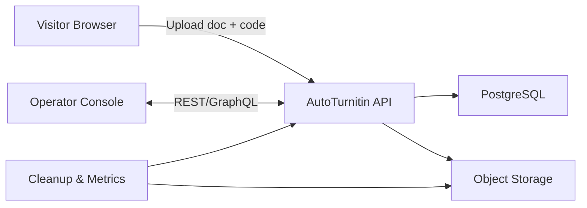

# AutoTurnitin 架构设计

## 系统上下文
- **Self-Service Web**：仿造原站的静态单页应用（SPA），通过 HTTPS 向后端 `/api` 提交任务。
- **AutoTurnitin API**：Node.js/NestJS 服务，负责检测码验证、任务入库、状态查询、报告文件授权。
- **Object Storage**：存储用户原稿与管理员上传的查重/AI 报告（建议使用 AWS S3/阿里云 OSS），配合签名 URL 控制 24 小时有效期。
- **Management Console**：与 API 共用认证的 React/Ant Design Pro 后台，供管理员登录操作。
- **Notification Worker**：周期任务，用于轮询过期记录、清理文件、触发提醒。

## 模块拆分
1. **Submission Module**
   - 校验检测码、保存提交表单、将文件推送到对象存储。
   - 生成 `submission_id` 与下载 token 供前端轮询。
2. **Detection Code Module**
   - 维护检测码生命周期（生成、绑定、失效）。
   - 支持批量导入（CSV）及批量查询。
3. **Report Delivery Module**
   - 管理员上传查重报告与 AI 报告，写入对象存储并更新状态。
   - 生成 24 小时有效的下载签名 URL。
4. **Operations Module**
   - KPI 图表、任务重试、异常记录、系统指标（队列 backlog、失败任务）。
5. **Admin & Auth Module**
   - 基于 Email + MFA 的登录、角色权限（运营、超级管理员）。

## 数据流
1. 访客提交表单后，前端直接将文件上传到 API（支持分片/断点）。
2. API 将文件保存到暂存桶并写入数据库 `submissions`，状态为 `processing`。
3. Admin 在后台筛选相应检测码，下载原稿，去官方 Turnitin 查询，随后上传查重/AI 报告文件。
4. 当报告上传完成并状态改为 `completed` 后，API 通知 Web（WebSocket/轮询）刷新，按钮变为可点击蓝色。
5. `Cleanup Worker` 每小时扫描超过 24 小时的记录，删除报告链接与对象存储文件，同时将状态标记为 `expired`。

## 技术选型
- **前端**：Vite + React + TypeScript，复刻参考站点的 UI；使用 Zustand 管理状态、TanStack Query 处理轮询。
- **后台**：Next.js Admin（仅 SSR 侧）或 Ant Design Pro；采用 RBAC 控制。
- **API**：NestJS + PostgreSQL + Prisma；采用多租户友好结构以备扩展。
- **存储**：对象存储 (S3/OSS) + Postgres Large Object，配合 Redis 用于短期状态缓存。
- **消息/队列**：BullMQ（Redis）调度异步任务与定时清理。

## 运维与安全
- 所有文件都带内容指纹与大小校验，避免重复上传。
- API 层开启速率限制（基于 IP + 检测码）。
- 管理员操作记录审计日志（写入 `admin_audit_logs`）。
- 采用 Cloudflare/CDN 缓解恶意上传。
- 日志集中（ELK/CloudWatch），关键指标（提交耗时、失败率）暴露到监控面板。
