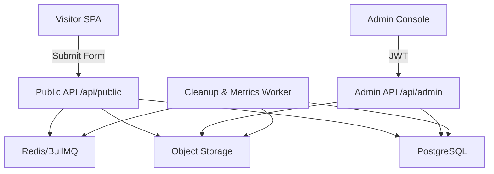

# AutoTurnitin 自助检测平台

Feature Name: autoturnitin-selfservice  
Updated: 2026-02-14

## Description
该设计将访客仿站前端、AutoTurnitin API、对象存储、运营后台与清理任务编排成端到端闭环。系统以检测码为核心，将用户提交、管理员人工处理与结果交付串联，实现“提交即等候、完成即下载、24 小时后清除”的体验。

## Architecture

- **Visitor SPA**：Vite + React，实现文件上传、检测码校验、状态轮询、进度提示、下载按钮状态切换。
- **Public API**：NestJS controller，处理公开提交、状态查询、下载签名 URL。
- **Admin API/Console**：同仓库下的 React（Ant Design）应用，通过 JWT + MFA 登录，调用 `/api/admin/*` 管理记录、检测码、上传报告与统计。
- **PostgreSQL**：持久化 submissions、detection_codes、reports、orders、admin_users、audit_logs。
- **Object Storage**：保存原稿与报告，路径按 submission 分区；通过 presigned URL 暴露下载。
- **BullMQ Worker**：负责 24 小时清理、发送通知、生成统计指标。

## Components and Interfaces
1. **Submission Service**
   - `createSubmission(dto, file)`：校验检测码、生成 submission_id、上传文件、写入 DB。
   - `getSubmissionStatus(id)`：返回状态、进度、报告可用性。
2. **DetectionCode Service**
   - `generateBatch(input)`：生成批次号及 codes[]。
   - `importCodes(csv)`：解析 CSV、校验格式、去重。
   - `lockCodeForSubmission(code, submissionId)`。
3. **Report Service**
   - `uploadReports(id, files)`：写对象存储、更新 DB、触发状态 ready。
   - `getDownloadUrl(id, type)`：生成带过期时间的签名 URL。
4. **Admin Console**
   - React 表格 + 过滤 + 批量操作；详情抽屉展示用户信息、原稿、上传历史；上传组件支持拖拽、显示文件大小与校验。
5. **Operations Dashboard**
   - ECharts/Chart.js 展示 KPI；失败任务列表支持一键重试。
6. **Cleanup Worker**
   - CRON 每小时执行：扫描 ready 且超过 24h 的 submissions，删除对象存储文件、更新状态、写 audit。

## Data Models (核心字段)
- `submissions`
  - `id`, `display_id`, `detection_code_id`, `full_name`, `email`, `document_type`, `word_count`, `status`, `progress_message`, `expires_at`, `created_at`, `updated_at`.
- `detection_codes`
  - `id`, `code`, `batch_id`, `status (available|in-use|used|expired|invalid)`, `quota`, `notes`, `expires_at`.
- `reports`
  - `id`, `submission_id`, `type (similarity|ai)`, `storage_key`, `filesize`, `uploaded_by`, `uploaded_at`, `download_count`, `valid_until`.
- `admin_users`
  - `id`, `email`, `password_hash`, `role`, `mfa_secret`, `last_login_at`, `status`.
- `admin_audit_logs`
  - `id`, `actor_id`, `action`, `resource`, `payload`, `ip`, `created_at`.

## Correctness Properties
1. **Detection Code Uniqueness**：每个 `detection_code_id` 只能绑定一个 submission；数据库层使用唯一约束 + 行级锁保证。
2. **Retention Guarantee**：`reports.valid_until = uploaded_at + 24h`，清理任务在到期后删除文件并将 submission 状态置为 `expired`。
3. **Audit Completeness**：所有管理员敏感操作（状态修改、下载、删除、任务重试）必须写入 `admin_audit_logs`，缺失时拒绝提交。
4. **Download Authorization**：仅当 `status === ready` 且 `now < valid_until` 时生成签名 URL；其余情况返回 `403/410`。

## Error Handling & Resilience
- Public API 对上传提供分片/断点续传，失败时回滚数据库变更并释放检测码状态。
- 全局异常过滤器将错误映射为统一 JSON（含 errorCode）。
- 对象存储上传失败会重试三次，仍失败则记录 `report_upload_failed` 事件。
- BullMQ Worker 记录重试次数；超过阈值时写入 `failed_jobs` 表并向管理员发送邮件。
- 前端轮询若遇到 5xx，显示“系统繁忙，请稍后重试”并指数退避。

## Test Strategy
- **Unit Tests**：Service 层（检测码校验、状态流转、报告上传）。
- **Integration Tests**：API 端点（提交、状态查询、下载、管理员更新）；使用 Supertest + in-memory Postgres/Redis。
- **E2E Tests**：Playwright 覆盖仿站流程（上传、状态观察、等待 ready、下载按钮变化）。
- **Performance Tests**：k6/Artillery 模拟 50 并发上传，确保 CPU/内存阈值内。
- **Security Tests**：ZAP/OWASP 检测常见漏洞，验证上传 MIME 检查、授权逻辑。

## References
1. Reference UI: https://www.turnitin-service.com/similarity
2. Docs: `.monkeycode/docs/ARCHITECTURE.md`, `.monkeycode/docs/INTERFACES.md`
